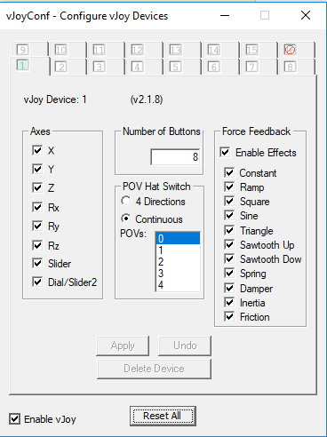
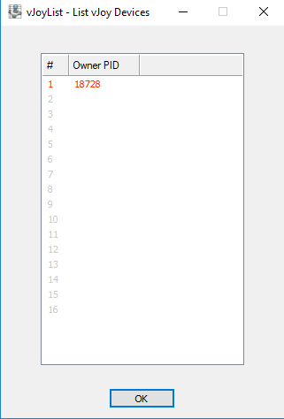
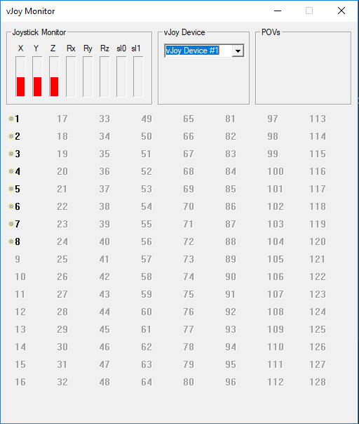

# End To End Autonomous Car
Winter 18-19 Technion Project

# Installing vJoy Controller
* Go to: http://vjoystick.sourceforge.net/site/index.php/download-a-install/download
and download the device

* Download the vJoy python API from our github in the utils directory.
* Extract the folder to your python environment: /python-path/Lib/site-packages
* Use the vJoy tools-set to verify it's working properly:

